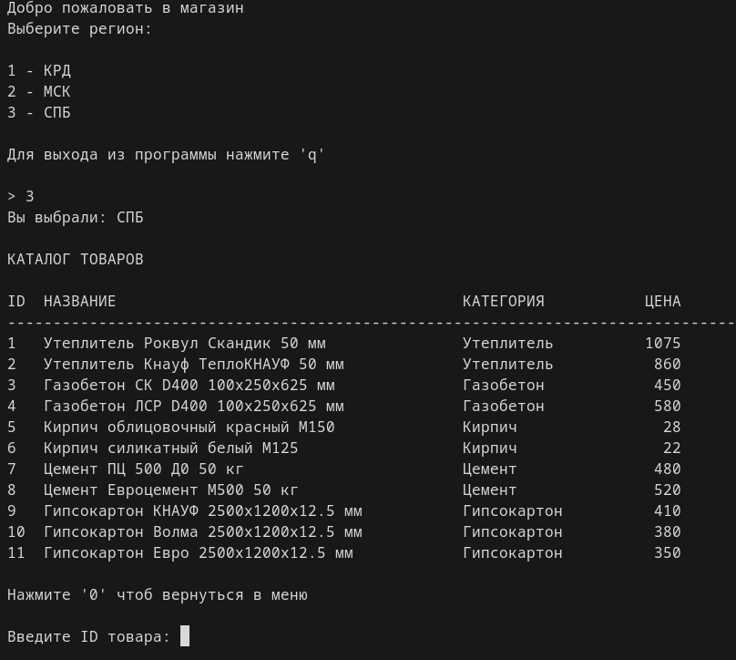

# Building Materials Store (CLI App)

Тестовое задание для Монолит Северо-запад

Консольное приложение для формирования заявки на строительные материалы с учётом региона и логики удержания клиента (скидка или предложение более дешёвого аналога).


---

## Запуск

Из корня проекта:

```bash
python main.py
```
---

## Демо



## Логика работы

1. Пользователь выбирает регион
2. Отображается список товаров с ценами
3. Пользователь выбирает товар
4. Подтверждает заказ
5. Если отказ:
   - ищется самый дешёвый товар в категории
   - формируется предложение (аналог или скидка)
6. При подтверждении создаётся JSON-заявка

---

## Структура проекта

- application/ # запуск приложения
- services/ # бизнес-логика
- models/ # доменные модели
-  views/ # консольный UI
- data/ # каталог товаров (JSON)
- orders/ # сохранённые заявки

---

## Бизнес-логика

- Каталог загружается из `data/materials.json`
- Цены зависят от региона
- Удержание клиента:
  - поиск минимальной цены в категории
  - скидка 5% если товар уже самый дешёвый
